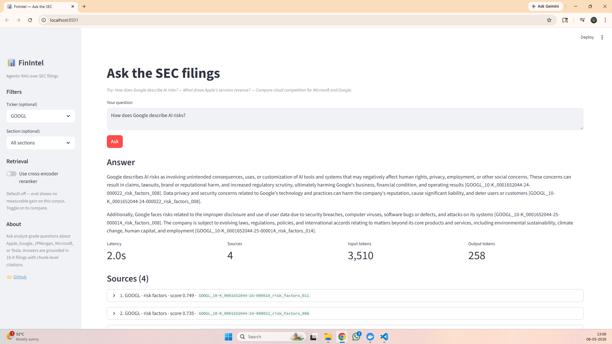
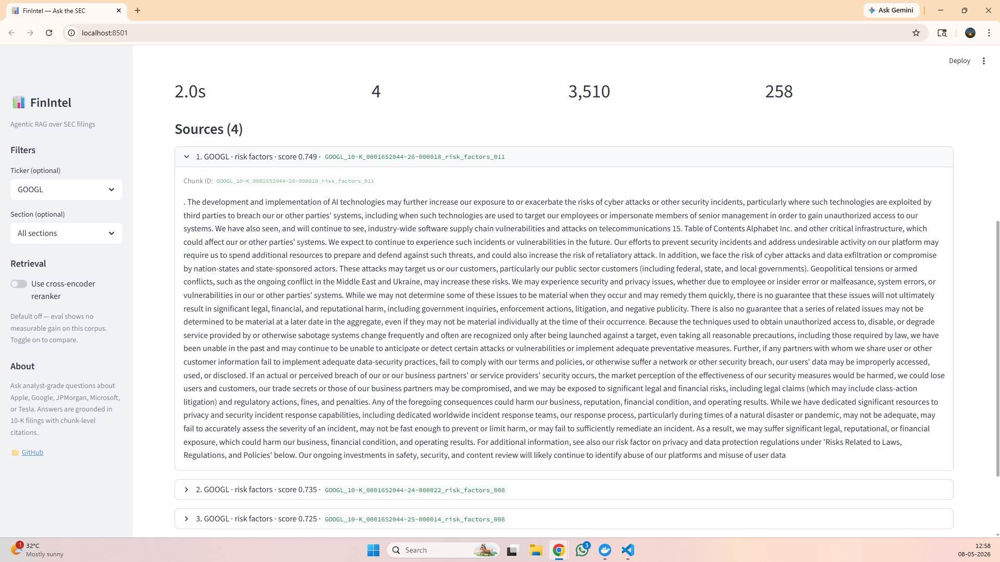
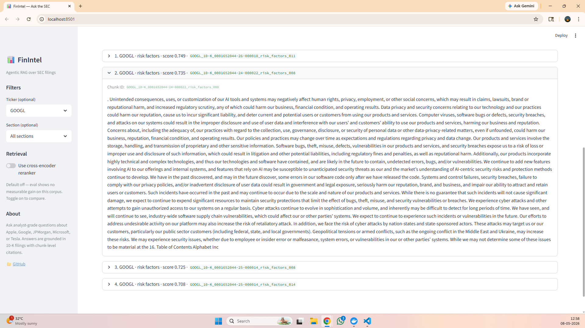
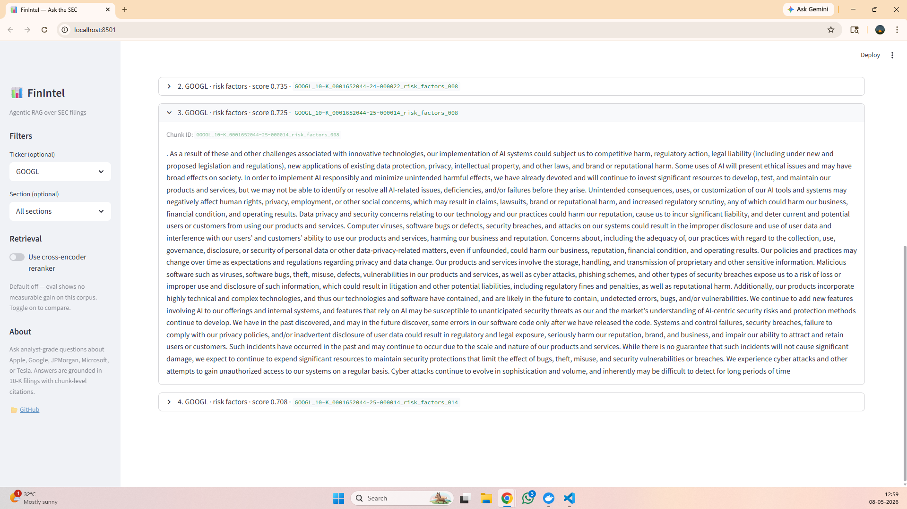
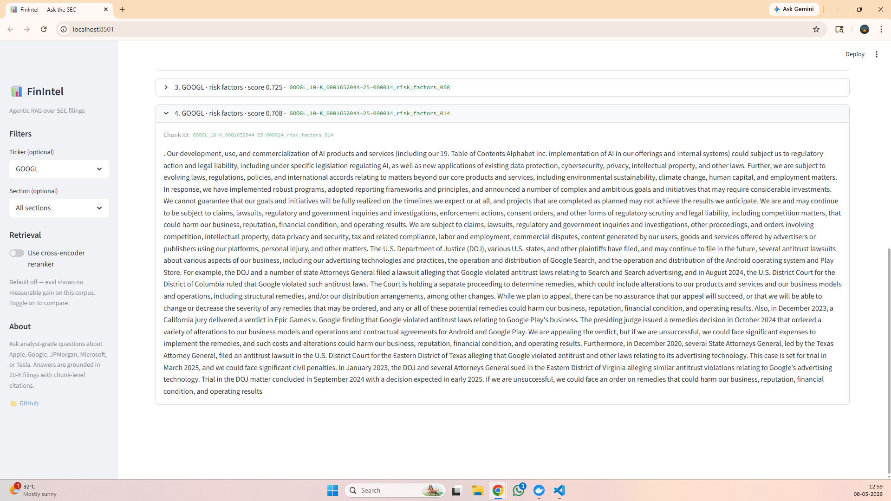

# FinIntel — Agentic RAG for SEC Filings

> Analyst-grade question answering over SEC 10-K filings, with chunk-level citations and metadata-filtered retrieval. Built end-to-end in Python with uv, Qdrant, BGE embeddings, and Llama 3.3 70B.

  

---

## What it does

Ask analyst-style questions about Apple, Google, JPMorgan, Microsoft, or Tesla — get answers grounded in their actual SEC filings, with every claim traceable to a specific chunk of a specific 10-K.

```
Q: How does Google describe risks from artificial intelligence?
A: Google identifies four categories of AI risk in their 10-K filings:
   unintended social consequences [GOOGL_10-K_..._risk_factors_008],
   cybersecurity exacerbation [GOOGL_10-K_..._risk_factors_011],
   regulatory and antitrust exposure [GOOGL_10-K_..._risk_factors_014],
   and competitive harm from rapid technological change [...risk_factors_008].
```

Latency: ~2 seconds. Cost per query: $0 (Groq free tier).

---

## Demo


*Asking an analyst question with sidebar filters; response generated in 2 seconds with chunk-level citations.*





*Each citation expands to show the exact chunk used, similarity score, and chunk ID for verification.*

---

## Why this exists

Naive RAG fails on financial filings for three reasons:

1. **The documents are gnarly.** A single 10-K is a 10MB SGML envelope wrapping 90+ sub-documents (HTML, XBRL, exhibits). The actual readable prose is buried.
2. **Section structure varies by filer.** Apple's "Item 7" is the MD&A. JPMorgan's Item 7 is a 395-character pointer to an embedded annual report — they incorporate the real MD&A into the same document under a different heading. Most parsers silently produce garbage on banks.
3. **Multi-company queries break naive top-K retrieval.** Asking "compare AAPL, MSFT, and GOOGL" with a flat top-6 retrieval often surfaces 6 chunks from one company.

FinIntel addresses all three with a deliberate pipeline: SGML-aware extraction, per-filing-type section configs with exhibit fallbacks, metadata-filtered semantic search, and a Streamlit UI for interactive exploration.

---

## Architecture

```
┌─────────────┐     ┌──────────────┐     ┌──────────────────────┐
│ SEC EDGAR   │────▶│   Parser     │────▶│  Section text files  │
│  (40 10-Ks) │     │  (SGML +     │     │  Risk Factors + MD&A │
└─────────────┘     │   BS4 + re)  │     │   per filing         │
                    └──────────────┘     └──────────┬───────────┘
                                                    │
                                                    ▼
                                         ┌──────────────────────┐
                                         │   Token-aware        │
                                         │   Chunker            │
                                         │  (~800 tok, BGE      │
                                         │   tokenizer)         │
                                         └──────────┬───────────┘
                                                    │
                                                    ▼
                                         ┌──────────────────────┐
                                         │    BGE-base          │
                                         │    Embeddings        │
                                         │    (768-dim)         │
                                         └──────────┬───────────┘
                                                    │
                                                    ▼
       ┌─────────────────────────────────────────────────────┐
       │                  Qdrant (Docker)                    │
       │   1,259 chunks · cosine · metadata-filterable       │
       └────────────────┬────────────────────────────────────┘
                        │
   ┌────────────────────▼─────────────────────┐
   │  RAG Pipeline                            │
   │   1. Embed query                         │
   │   2. Filter by ticker / section          │
   │   3. Retrieve top-K (optional rerank)    │
   │   4. Generate with Llama 3.3 70B (Groq)  │
   │   5. Return answer + cited sources       │
   └────────────────────┬─────────────────────┘
                        │
                        ▼
                 ┌─────────────┐
                 │ Streamlit   │
                 │     UI      │
                 └─────────────┘
```

---

## Tech stack

| Layer | Tool | Why |
|---|---|---|
| Project mgmt | **uv** + **hatchling** + `src/` layout | Modern Python; lockfiles; reproducible installs |
| Ingestion | **sec-edgar-downloader** + **tenacity** | Official SEC client + retry-with-backoff for flaky networks |
| Parsing | **BeautifulSoup4** + **lxml** + regex | iXBRL HTML → clean text + heuristic Item-N section finder |
| Chunking | **langchain-text-splitters** + **tiktoken** | Token-aware recursive splitting |
| Embeddings | **BGE-base-en-v1.5** (sentence-transformers) | Free, runs on CPU, top-10 on MTEB |
| Vector DB | **Qdrant** (Docker) | Free, fast, metadata-aware filtering |
| LLM | **Llama 3.3 70B** via **Groq** | Free tier, GPT-4o-class quality, OpenAI-compatible API |
| Reranking | **ms-marco-MiniLM-L-6-v2** (optional) | Tested, kept toggleable, default off (see eval below) |
| UI | **Streamlit** | 100 lines of Python → demo-ready interactive app |
| Eval | Custom keyword-based + RAGAS-ready | Reproducible metrics, timestamped results |

---

## Evaluation

| Configuration | Recall | Citations | Tokens | Latency |
|---|---|---|---|---|
| Baseline (BGE-base, top-4) | **0.79** | 3.6 | 34K | ~2s |
| + ms-marco-MiniLM reranker (top-4 from 12) | 0.78 | 3.1 | 37K | ~3s |

**Honest finding:** the cross-encoder reranker did not improve keyword recall on this 10-question eval set, while adding ~10% to token cost and ~50% to wall-clock time. Kept as a toggleable option (`--rerank`) since it may help on harder corpora or with LLM-based grading. *Default: off.*

> **Eval methodology:** keyword matching against curated `must_mention` terms across 9 factual questions + 1 refusal-test question.
> **Future work:** add LLM-as-judge grading (RAGAS) to catch semantic equivalences the keyword approach misses.

Reproduce:

```bash
uv run python -m evals.run --label baseline
uv run python -m evals.run --rerank --label rerank
```

Results land in `evals/results/` as timestamped JSON.

---

## Engineering decisions worth talking about

These are the kinds of choices a recruiter will probe in an interview. Each one was deliberate.

### Why `src/` layout + hatchling, not flat scripts
A `src/` layout forces you to install the package to use it, which catches a class of "works on my machine" bugs (silent imports of local copies). Standard in every serious open-source Python project (FastAPI, Pydantic, Polars).

### Why BGE-base embeddings, not OpenAI's `text-embedding-3`
BGE-base is free, runs on CPU in reasonable time, and ranks top-10 on the MTEB retrieval benchmark — competitive with paid alternatives. The whole pipeline runs at zero cost during development. We can swap to OpenAI later by changing one constructor argument; the abstraction is provider-agnostic.

### Why Qdrant in Docker, not Pinecone or Chroma
Qdrant gives us metadata-filtered search out of the box (essential for ticker-scoped queries), runs locally for free, and produces a Docker image that mirrors how a production deployment would look. Pinecone is paid; Chroma's metadata filtering is less mature.

### Why Groq + Llama 3.3 70B, not direct OpenAI / Anthropic
Groq's free tier provides Llama 3.3 70B (GPT-4o-class quality) at 14,400 requests/day with no credit card. The API is OpenAI-compatible, so the code is portable to any OpenAI-style provider via one env-var change (`LLM_BASE_URL`, `LLM_MODEL`). Provider-agnostic by design.

### The JPM "395-character MD&A" incident
Initial parser run produced 395-character MD&As for all four JPMorgan filings — the same number across years. Investigation revealed JPM's `Item 7` is a brief pointer because their actual MD&A is embedded directly in the primary 10-K under annual-report-style headings (not Item-numbered). The parser now falls back to heading-based extraction (`Management's Discussion and Analysis` → next major section header) when Item-N extraction is suspiciously short. Generalizes to other banks/conglomerates that file similarly.

### Why default `top_k=4` (not 6 or 10)
Empirical: the diminishing-returns curve is steep above 4 chunks. 4 well-targeted chunks beats 8 noisy ones, and stays comfortably under per-minute token caps on free tiers. Validated against an eval set rather than guessed.

### Why we measure retrieval before tuning prompts
A weak retrieval can be papered over with longer prompts, but you've then optimized the wrong layer. Measuring retrieval first (chunks recalled, source diversity) makes downstream prompt work cheap and credible.

---

## Local setup

```bash
# 1. Clone and install
git clone https://github.com/<you>/finintel.git
cd finintel
uv sync

# 2. Start Qdrant
docker run -d --name finintel-qdrant -p 6333:6333 \
    -v "$(pwd)/qdrant_storage:/qdrant/storage" qdrant/qdrant

# 3. Configure secrets — copy template, fill in
cp .env.example .env
# Edit .env to add:
#   GROQ_API_KEY=gsk_...           (https://console.groq.com)
#   SEC_USER_AGENT="Your Name your_email@example.com"

# 4. Build the corpus (one-time, ~10-15 minutes)
uv run python -m finintel.ingestion.sec_client    # download 40 filings
uv run python -m evals.build_index                 # parse, chunk, embed, index

# 5. Run the UI
uv run streamlit run src/finintel/ui/app.py
```

---

## Project structure

```
finintel/
├── src/finintel/
│   ├── ingestion/      # SEC EDGAR client + SGML/HTML parser
│   ├── retrieval/      # Chunker, embedder, Qdrant wrapper, reranker
│   ├── agent/          # RAG pipeline + prompts
│   └── ui/             # Streamlit app
├── notebooks/          # Exploration + indexing pipelines (committed)
├── evals/              # Eval set, runner, results
├── tests/              # pytest
├── docs/screenshots/   # README screenshots
├── pyproject.toml      # uv-managed dependencies
└── README.md
```

---

## Roadmap

- [x] **Week 1**: Repo scaffold + SEC EDGAR ingestion (40 10-Ks, 5 tickers, 4 years each)
- [x] **Week 2**: Section extraction (with EX-13 fallback) + token-aware chunking
- [x] **Week 2**: BGE embeddings → Qdrant indexing (1,259 chunks)
- [x] **Week 2**: Baseline RAG with Llama 3.3 70B + Streamlit UI
- [x] **Week 2**: 10-question eval harness with measured baseline + rerank A/B
- [ ] **Week 3**: LangGraph agent (planner → retriever → critic) for multi-hop queries
- [ ] **Week 3**: RAGAS evaluation (LLM-as-judge for faithfulness, relevancy)
- [ ] **Week 4**: Multi-company query decomposition (per-ticker retrieval)
- [ ] **Week 5**: Add 10-Q ingestion + temporal queries
- [ ] **Week 6**: Deploy to Hugging Face Spaces + 90-second demo video

---

## License

MIT
